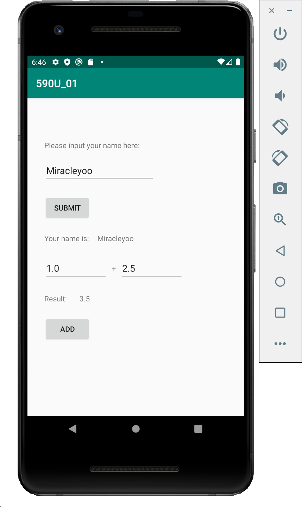

# Android-Start-Dash

This is an easy and clean android program. It contains a name shower and a adder. You can learn how to build the most basic android application here.

This project is built for Umass class COMPSCI590U to provide a guide for Android programming. More information can be found at [Google Developer Official Site](https://developer.android.com/guide). Run demo can be found here.

